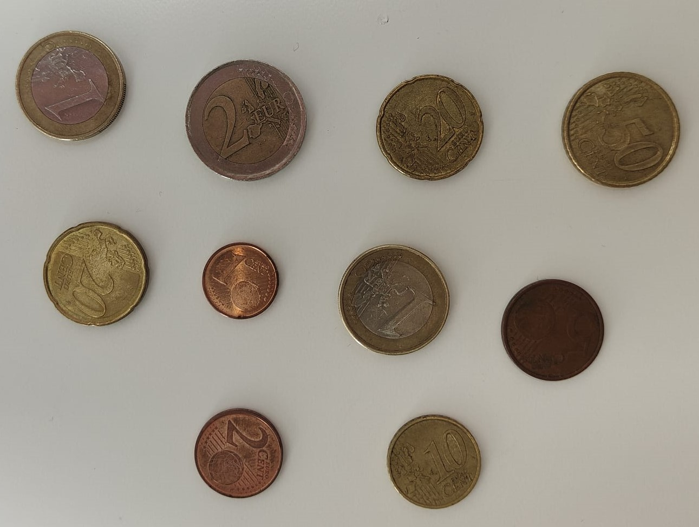

# Práctica 3 VC - Curso 2023/2024

En esta tercera práctica se proponen 3 nuevas tareas. Las dos primeras, están relacionadas con la **contabilización de monedas**, teniendo que identificar cuantas monedas se detectan en la imagen en la primera tarea, y contando la cantidad total de dinero que se muestra en la imagen en la segunda. Por último, se deberán emplear las herramientas usadas en las primeras tareas con el objetivo de realizar una clasificación, lo más próxima posible a la realidad, entre diferentes tipos de **microplásticos** (fragmentos, pellet y alquitrán).

*Trabajo realizado por*:
- **Jorge Vega Sánchez**
- **Daniel Betancor Zamora**

## Tarea 1

**Enlace a la tarea**: [Tarea 1](Tarea%201.ipynb).

El código comienza importando las bibliotecas necesarias: cv2 para OpenCV, numpy para la manipulación de matrices y matplotlib.pyplot para la visualización de imágenes. Luego, se carga una imagen de monedas desde un archivo llamado 'monedas-objetos-1.jpg' y se convierte de BGR a RGB para su visualización. La imagen se muestra en una ventana utilizando matplotlib, lo que permite ver la imagen original.

A continuación, se convierte la imagen a escala de grises para facilitar el procesamiento. Se calcula el histograma de la imagen en escala de grises con 256 bins, lo que muestra la distribución de intensidades de píxeles en la imagen. Se crea una figura con dos subparcelas para mostrar la imagen en escala de grises y su histograma.

Se define un umbral (umbral = 115) y se realiza una umbralización binaria invertida en la imagen en escala de grises. Esto se hace para resaltar las monedas y otros objetos en la imagen. Se muestran la imagen original y la imagen umbralizada (invertida) en dos subparcelas.

Luego, se utilizan las funciones de OpenCV cv2.findContours para encontrar todos los contornos en la imagen umbralizada. Se utiliza nuevamente la función cv2.findContours con cv2.RETR_EXTERNAL para encontrar solo los contornos externos en la imagen. Los contornos externos se dibujan en la imagen original en verde.

Se inicia un contador para realizar un seguimiento del número de monedas. Se recorren los contornos externos y se verifica si se asemejan a un círculo. Si el contorno se asemeja a un círculo, se incrementa el contador de monedas. Se imprime en la consola el número total de monedas detectadas en la imagen original. Se muestra una imagen en la que los contornos externos se han rellenado.

Posteriormente, se carga otra imagen de monedas desde un archivo llamado 'monedas-objetos-2.jpg' y se muestra en una ventana. La segunda imagen se convierte a escala de grises y se suavizan las altas frecuencias. Se utiliza la función cv2.HoughCircles para detectar círculos en la imagen procesada. Se imprime en la consola el número total de monedas detectadas en la segunda imagen.

Finalmente, se dibujan los círculos detectados en la imagen original y en una imagen negra, y se muestran ambas imágenes en una ventana.

## Tarea 2

**Enlace a la tarea**: [Tarea 2](Tarea%202.ipynb).

Para la realización de esta tarea partiremos de la solución obtenida en la tarea anterior. El objetivo ahora, será contar el total de dinero que se visualiza en la imagen. En este caso, hemos decidido escoger una nueva imagen en la cual solo hayan monedas, y que, además, tenga varias repetidas con la finalidad de comprobar el correcto funcionamiento del programa para contar el dinero total. La imagen de la cual haremos uso será la siguiente:

Acto seguido, se deberá aplicar un umbralizado a la imagen lo más preciso posible para conseguir que los contornos de las monedas sean fieles a los de la imagen original. Todos estos pasos son exactamente los mismos que fueron llevados a cabo en la tarea anterior.

Tras seleccionar el umbral idóneo, y aplicar las operaciones correspondientes para extraer los contornos de las monedas de la imagen umbralizada, se obtendrá el siguiente resultado: 

Esta imagen será clave a la hora de contabilizar el dinero total que aparece en la imagen, pues si hemos aplicado un buen umbralizado y una buena extracción de contornos, las proporciones entre monedas serán fieles a la realidad y se podrán distinguir unas de otras.

A continuación, definimos dos diccionarios. En el primero, se establece para cada clave (nombres de las monedas: 1cts, 2cts...) la proporción que presentan con respecto a la moneda de 1 euro. De esta manera, una vez se haya obtenido el diámetro de la moneda de 1 euro en la imagen, se podrá obtener el diámetro del resto de monedas de forma proporcional. El segundo diccionario simplemente asocia cada clave (nombres de las monedas) a el valor de las mismas (0.01, 0.50...).

Como es obvio, el siguiente paso será obtener el diámetro real de la moneda de 1 euro que aparece en la imagen. Para ello, aparecerá una ventana emergente en la que se nos permitirá seleccionar dicha moneda. La forma en la que funciona la selección de la moneda y la obtención del diámetro es sencilla:

- Configuración del evento de hacer *clic* para que ejecute la función correspondiente.
- Recorre todos los contornos de las monedas detectadas en los pasos anteriores.
- Calcula la distancia entre el punto en el que se hizo *clic* y el centro de la moneda de esa iteración.
- Si la distancia calculada es menor al radio de la moneda: se ha hecho *clic* en esa moneda.
- Se guarda el diámetro de la moneda en una variable.

Teniendo el diámetro de la moneda de 1 euro, se podrá calcular perfectamente el diámetro del resto de monedas.

Por último, se volverán a recorrer todos los contornos correspondientes a las monedas, y se obtendrá el diámetro de cada contorno. Se compara ese diámetro con los diámetros calculados en el paso anterior (se encuentran en un nuevo diccionario), y se selecciona la clave (nombre de la moneda) que tenga el valor de diámetro más parecido al del contorno que está siendo evaluado. Después de esto, solo quedará sumar en una variable el valor correspondiente a ese nombre de moneda (el cual puede ser encontrado en un diccionario que asocia nombres de moneda con valores).

Además de mostrar el dinero total que aparece en la imagen, hemos querido mostrar la imagen de las monedas original, pero indicando con texto cuál es el valor de cada una de las monedas presentes en ella con el objetivo de comprobar que el programa ha funcionado correctamente.

**Dinero Total = 5.08 €**

